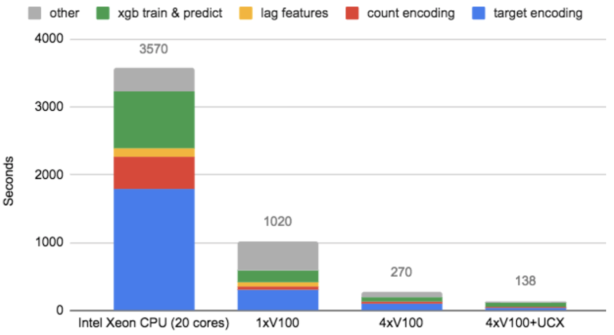

## GPU Accelerated Feature Engineering and Training for Recommender Systems (source)

This repository contains the code of the winning solution of the RecSys2020 Challenge - [*GPU Accelerated Feature Engineering and Training for Recommender Systems*](./RecSysChallenge2020.pdf)  - achieving the highest score in seven of the eight metrics used to calculate the final leaderboard position. In addition to the original end-2-end source code, the repository demonstrates the 25x speed-up by comparing highly optimized CPU ([dask](https://dask.org/) and [pandas](https://pandas.pydata.org/pandas-docs/stable/index.html)) with highly optimized GPU accelerated versions ([dask](https://dask.org/) and [cuDF](https://github.com/rapidsai/cudf)).

## Prerequisites
* Collect the data at the following location: https://recsys-twitter.com/data/show-downloads (you need to sign up to get access)
* RAPIDS cuDF 
** For *02_ModelsCompetition* use cuDF 0.13 
** For *01_Preprocess* and *03_ModelsBenchmark* use cuDF 0.14
* 1-4x GPU 32GB Tesla V100

## Structure

### Preprocessing

*01_Preprocess* contains the code for inital loading and transforming the original raw datasets (training.tsv, val.tsv and competition_test.tsv). For example, these transformation includes 
<li> transforming categorical features from String (hashes) into Integer to save disk space and memory
<li> extracting some text features from the tweets
<li> storing the dataset as parquet files

These preprocessing steps are run only once on the original dataset. The preprocessing steps are 6 jupyter notebooks. The repository contains optimized GPU versions for the first and second notebook.

### Feature Engineering and Model Training

*02_ModelsCompetition* contains the original code used for submission. It contains three models (XGBoost1, XGBoost2 and XGBoost3) and the Ensemble script as described in [*GPU Accelerated Feature Engineering and Training for Recommender Systems*](./RecSysChallenge2020.pdf). Each script uses [dask](https://dask.org/) and [cuDF](https://github.com/rapidsai/cudf) for Feature Engineering and GPU accelerated XGBoost for model training.

### Benchmark

*03_ModelsBenchmark* contains the highly optimized CPU and GPU code of the common techniques used for XGBoost1, XGBoost2 and XGBoost3. The GPU accelerated version shows a speed-up of 25x compared to optimized dask+pandas and a speed-up of 250x compared to pure pandas version. The repository contains code 
* optimized CPU (Intel Xeon CPU (20 cores))
* optimized MultiGPU (4xV100) 
* optimized MutliGPU (4xV100+UCX)

  

