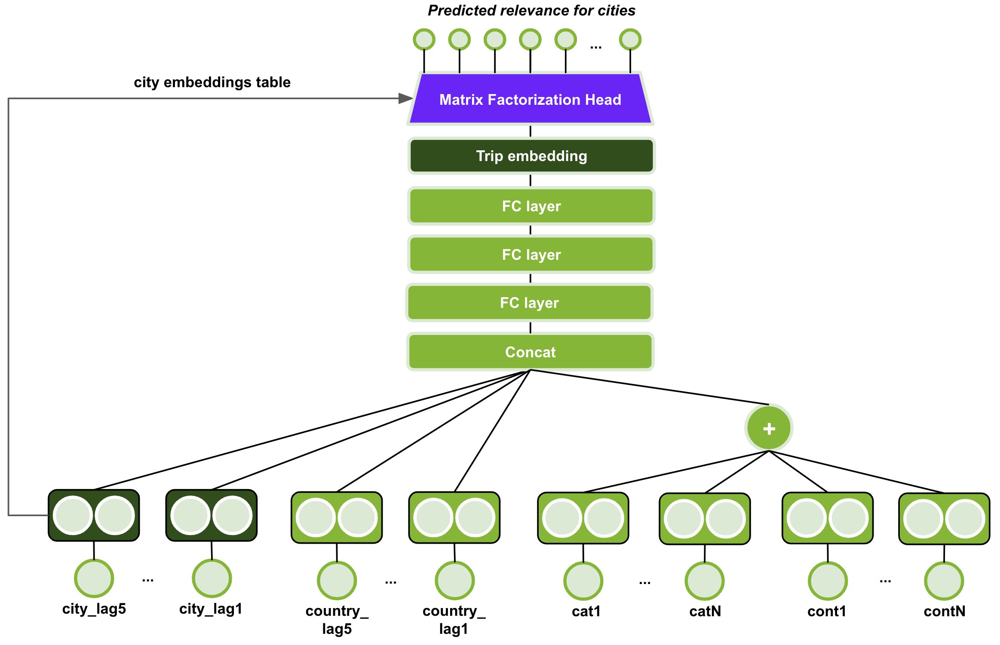
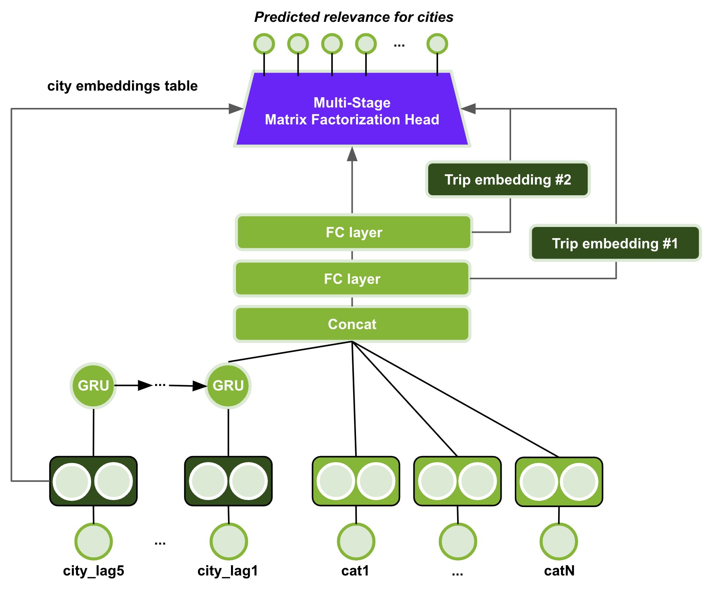
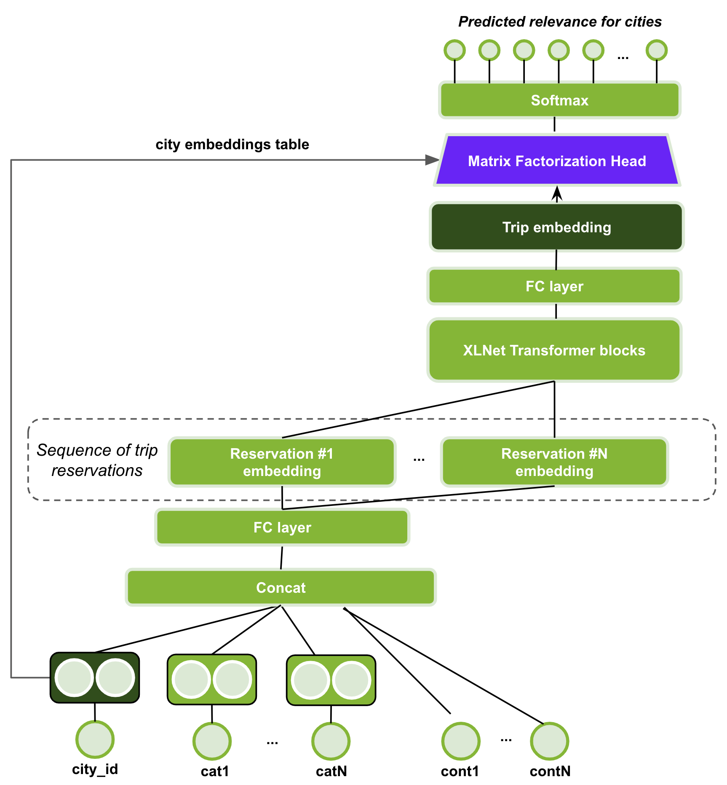

# Using Deep Learning to Win the Booking.com WSDM WebTour21 Challenge on Sequential Recommendations

This repository contains the code of the winning solution of the [WSDM2021 Booking.com Challenge](https://www.bookingchallenge.com/) - achieving 59.39 Precision@4. Our solution is a blend of 3 different neural network architectures, each trained multiple times with different seeds.

The code for XLNet-SMF will be added soon.

## Prerequisites
* Download the data from https://www.bookingchallenge.com/
* Pandas==1.2.0
* TensorFlow>=2.x
* PyTorch
* cuDF

This [nvtabular:0.3](https://ngc.nvidia.com/catalog/containers/nvidia:nvtabular) docker container has most libaries pre-installed. Pandas requires an update to 1.2.0 version.

## Structure

The code is written in multiple jupyter notebooks.

**Files:**
- *00_Data* is the folder, containing the original train and test csv files. Preprocessed data will be stored there, as well.
- *01_Preprocess/Preprocess.ipynb* splits data in 5-folds for cross-validation and assigns the fold to each example
- *02_Models/GRU_SM_SMF/GRU-SM-SMF.ipynb* trains the GRU-SM-SMF model (see some details below)
- *02_Models/GRU_SM_SMF/GRU-SM-SMF-Ensemble.ipynb* blends (average) the trained model with *GRU-SM-SMF.ipynb* to intermediate prediction
- *02_Models/MLP_SMF/MLP-SMF.ipynb* trains the MLP-SMF model (see some details below)
- *02_Models/MLP_SMF/MLP-SMF-Ensemble.ipynb* blends (average) the trained model with *MLP-SMF.ipynb* to intermediate prediction
- *03_Ensemble/Ensemble.ipynb* ensembles MLP-SMF, GRU-SM-SMF and XLNet-SMF

## Details

### MLP-SMF

  

MLP-MF is trained 8 times with different seed.

### GRU-SM-SMF

  

GRU-MF is trained 7 times with different seeds and a small variation on input features.

| Ver | Remove Features                |
|-----|--------------------------------|
| 31  | 'gap_','isweekend_', 'season_' |
| 32  | 'gap_'                         |
| 33  | 'isweekend_', 'season_'        |
| 36  | None                           |
| 40  | 'isweekend_', 'season_'        |
| 41  | 'isweekend_', 'season_'        |
| 44  | None                           |

### XLNet-SMF

  

